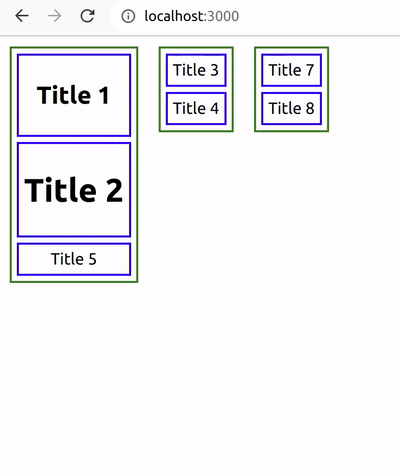

# simple-drag-and-drop (Compatiable with React, Angular, VueJS)

## Install

```bash
npm install simple-drag-and-drop --save
```

## Example



## Demo Links

[React Demo](https://drag-drop-library.bittokazi.com/react)

## Usage

#### Use in Plain Javascript

```html
<body>
  <div class="dd-container" id="dd1">
    <div>
      <h2>Title 1</h2>
    </div>
    <div>
      <h1>Title 2</h1>
    </div>
    <div>Title 5</div>
  </div>
  <div class="dd-container" id="dd2">
    <div>Title 3</div>
    <div>Title 4</div>
  </div>
  <div class="dd-container" id="dd3">
    <div>Title 7</div>
    <div>Title 8</div>
  </div>
</body>
<script>
  window.onload = () => {
    let dd = new DragAndDrop();
    let ddc1 = new DragAndDropContaner("dd1", dd);
    let ddc2 = new DragAndDropContaner("dd2", dd);
    let ddc3 = new DragAndDropContaner("dd3", dd);
  };
</script>
<style>
  .dd-container {
    float: left;
    min-height: 70px;
    min-width: 50px;
    border: 2px green solid;
    margin: 10px 10px;
  }
  .dd-container > div {
    padding: 5px;
    border: 2px blue solid;
    margin: 5px 5px;
    cursor: pointer;
  }
</style>
```

<br>

#### Use in React

```html
App.js

import React, { Component } from "react";
import "./App.css";
import { DragAndDrop, DragAndDropContaner } from "simple-drag-and-drop";

export class App extends Component {
  constructor(props) {
    super(props);
    this.dd = null;
    this.ddc1 = null;
    this.ddc2 = null;
    this.ddc3 = null;
  }
  initDD() {
    this.ddc1.reInit();
    this.ddc2.reInit();
    this.ddc3.reInit();
  }
  componentWillMount() {}
  componentDidMount() {
    this.dd = new DragAndDrop();
    this.dd.setRender(true);
    this.dd.setOnMovedCallback((result) => {
      console.log(result);
    });
    this.ddc1 = new DragAndDropContaner("dd1", this.dd);
    this.ddc2 = new DragAndDropContaner("dd2", this.dd);
    this.ddc3 = new DragAndDropContaner("dd3", this.dd);
    setTimeout(() => {
      this.initDD();
    }, 100);
  }
  componentWillUnmount() {
    if (this.ddc1 != null) this.dds1.remove();
    if (this.ddc2 != null) this.dds2.remove();
    if (this.ddc3 != null) this.dds3.remove();
  }
  render() {
    return (
      <div className="App">
        <div class="dd-container" id="dd1">
          <div>
            <h2>Title 1</h2>
          </div>
          <div>
            <h1>Title 2</h1>
          </div>
          <div>Title 5</div>
        </div>
        <div class="dd-container" id="dd2">
          <div>Title 3</div>
          <div>Title 4</div>
        </div>
        <div class="dd-container" id="dd3">
          <div>Title 7</div>
          <div>Title 8</div>
        </div>
      </div>
    );
  }
}

export default App;


App.css

.dd-container {
  float: left;
  min-height: 70px;
  min-width: 50px;
  border: 2px green solid;
  margin: 10px 10px;
}
.dd-container > div {
  padding: 5px;
  border: 2px blue solid;
  margin: 5px 5px;
  cursor: pointer;
}
```

<br>

#### Use in Angular

```html
Documentation Coming Soon
```

<br>

#### Use in VueJS

```html
Documentation Coming Soon
```

<br>

## Options

### Function

| Name     | Type | Description                                                                                  |
| -------- | :--- | -------------------------------------------------------------------------------------------- |
| reInit() | n/a  | Re Initilizes Drag and Drop Container Items(Usage: Call it after setting the state in React) |
| remove() | n/a  | Removes all Event listeners. (Usage: Call it when component is unmounted)                    |

